# Criando VM MySql no Portal do Azure

- Abra o [Portal Azure](https://portal.azure.com/)
- Digite Mysql na barra de pesquisa
  - Clique em Servidores do Banco de Dados do Azure para Mysql

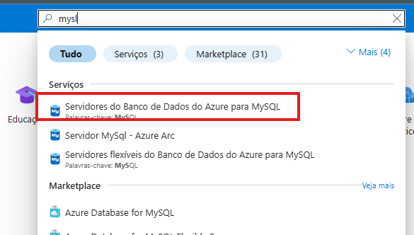

- CLique no botão  Banco de Dados do Azure para MySQL ou no botão Criar

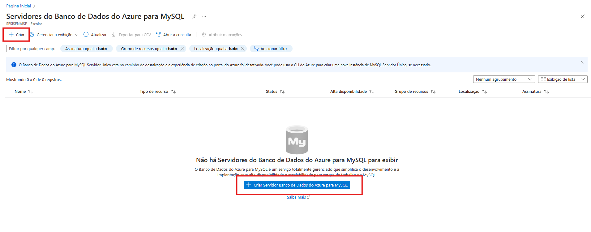

- Em servidor Flexivel clique no botão - Criação Avançada

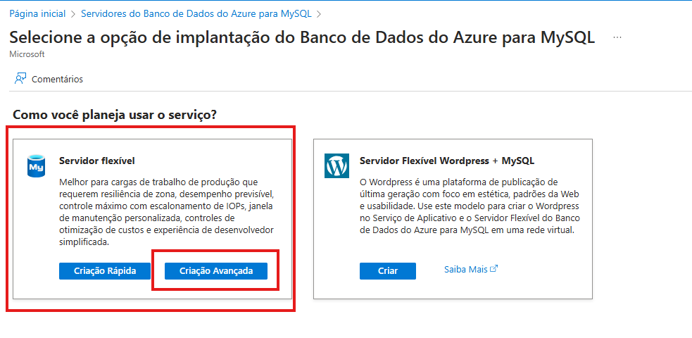

Agora temos que configurar:

- Grupo de Recursos: aulabd
- Nome servidor:  bdserversobrenome
- Região: Brasil Sul
- Versão: 8.0
- Tipo de Carga: Para bancos de dados de pequeno ou médio porte

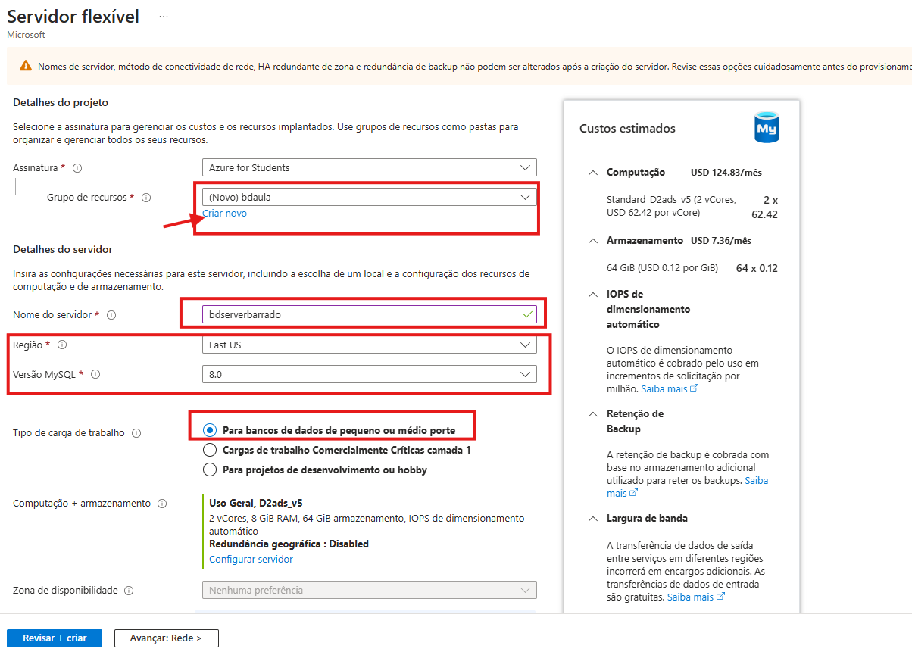

* Autenticação: MySQL
 
    * crie um usuário e senha

    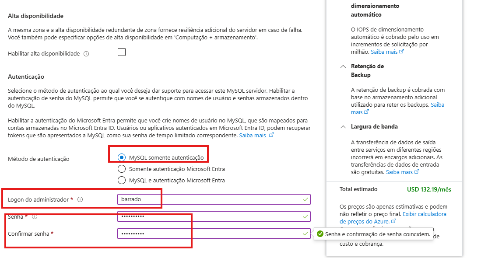

* Avance para Redes
    * Selecione: Acesso público (endereços IP permitidos) e ponto de extremidade privado
    * Acesso público: Permitir acesso público a este recurso pela Internet usando um endereço IP público (ativado)
    * Regras de Firewall: Permitir o acesso público de qualquer serviço do Azure de dentro do Azure para esse servidor
 (ativado)

 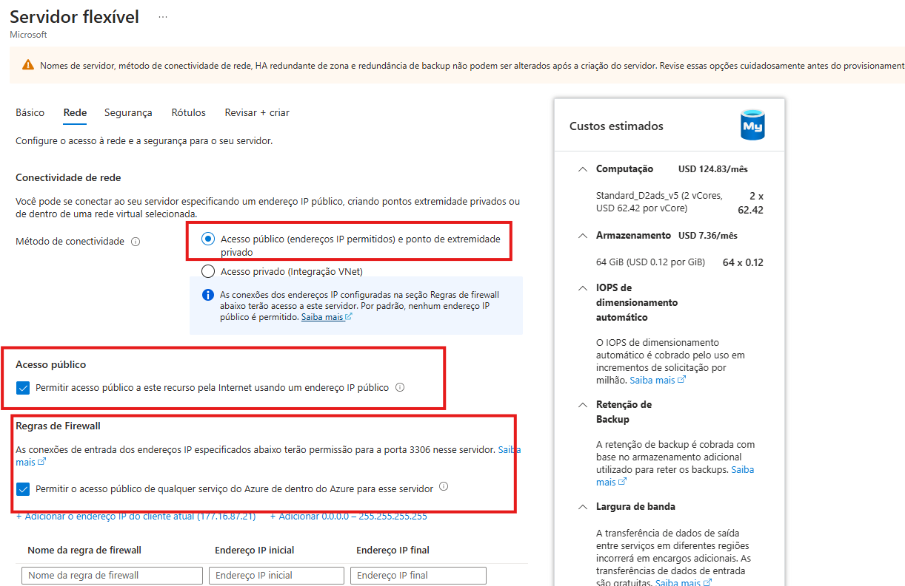

 * Por fim, clique em Revisar e Criar e depois em Criar
    - **caso apresente erro, volte ao inicio do processo e altere para regiões Israel, Espanha Central, Central US ou outra**

 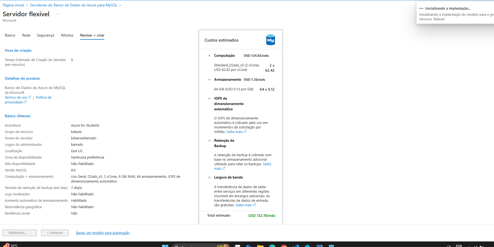

 * Aguarde

 # Criando conexão no Workbench

 * Acesse o Workbench
 * Clique em criar nova conexão Mysql

 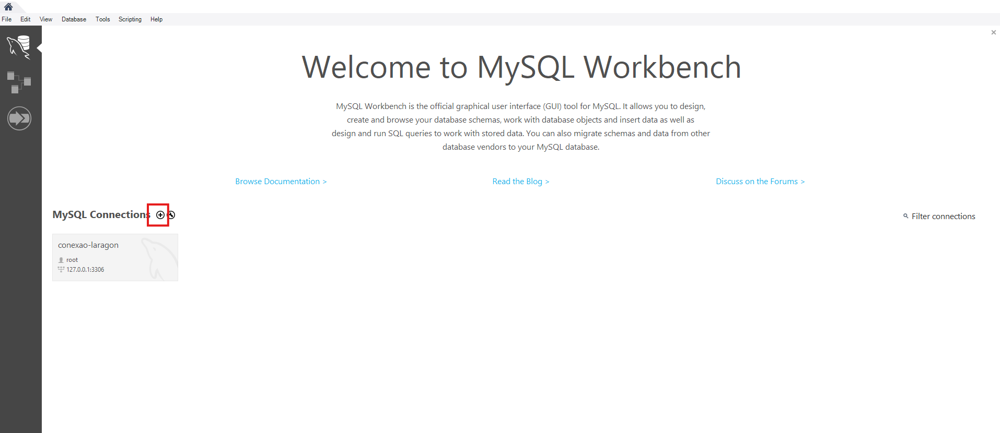

- Acesse o recurso Banco de Dados do Azure para MySQL e anote os dados
    - servidor
    - Administrador do Banco de Dados
    - Senha
- Agora adicione um nome à conexão no Workbench e configure as informações conforme necessário

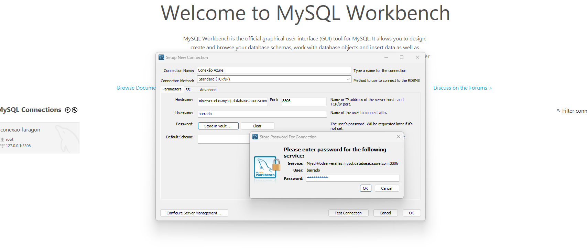

# Criando Base de Dados

- Acesse a conexão criada;
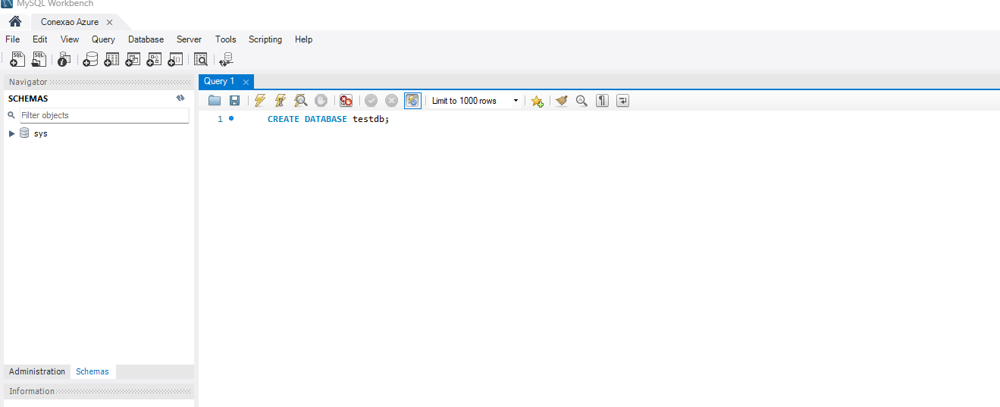

>  CREATE DATABASE ecommerce_db;

````
USE ecommerce_db;

CREATE TABLE clientes (
    id INT AUTO_INCREMENT PRIMARY KEY,
    nome VARCHAR(100) NOT NULL,
    email VARCHAR(100) UNIQUE NOT NULL,
    senha_hash VARCHAR(255) NOT NULL,
    data_cadastro TIMESTAMP DEFAULT CURRENT_TIMESTAMP
);

CREATE TABLE produtos (
    id INT AUTO_INCREMENT PRIMARY KEY,
    nome VARCHAR(100) NOT NULL,
    descricao TEXT,
    preco DECIMAL(10,2) NOT NULL,
    estoque INT NOT NULL,
    data_criacao TIMESTAMP DEFAULT CURRENT_TIMESTAMP
);

CREATE TABLE pedidos (
    id INT AUTO_INCREMENT PRIMARY KEY,
    cliente_id INT,
    total DECIMAL(10,2) NOT NULL,
    status ENUM('Pendente', 'Pago', 'Enviado', 'Entregue') DEFAULT 'Pendente',
    data_pedido TIMESTAMP DEFAULT CURRENT_TIMESTAMP,
    FOREIGN KEY (cliente_id) REFERENCES clientes(id)
);

````

## 📌 Inserindo Clientes

````
INSERT INTO clientes (nome, email, senha_hash) VALUES
('Ana Silva', 'ana.silva@email.com', 'hash_senha_ana'),
('Carlos Souza', 'carlos.souza@email.com', 'hash_senha_carlos'),
('Mariana Oliveira', 'mariana.oliveira@email.com', 'hash_senha_mariana');
````

## 📌 Inserindo Produtos

````
INSERT INTO produtos (nome, descricao, preco, estoque) VALUES
('Notebook Dell Inspiron', 'Notebook com processador Intel i5 e 8GB RAM', 3500.00, 10),
('Smartphone Samsung Galaxy S23', 'Celular com câmera de 50MP e 128GB', 4200.00, 15),
('Fone de Ouvido Bluetooth', 'Fone sem fio com cancelamento de ruído', 250.00, 30);
````

## 📌 Inserindo Pedidos

````
INSERT INTO pedidos (cliente_id, total, status) VALUES
(1, 3500.00, 'Pago'),
(2, 4200.00, 'Enviado'),
(3, 250.00, 'Pendente');
````

## 📌 Inserindo Itens nos Pedidos

````
CREATE TABLE itens_pedido (
    id INT AUTO_INCREMENT PRIMARY KEY,
    pedido_id INT,
    produto_id INT,
    quantidade INT NOT NULL,
    preco_unitario DECIMAL(10,2) NOT NULL,
    FOREIGN KEY (pedido_id) REFERENCES pedidos(id),
    FOREIGN KEY (produto_id) REFERENCES produtos(id)
);

INSERT INTO itens_pedido (pedido_id, produto_id, quantidade, preco_unitario) VALUES
(1, 1, 1, 3500.00),
(2, 2, 1, 4200.00),
(3, 3, 1, 250.00);

````
## 📌 Consultas


1️⃣ Listar todos os clientes cadastrados

> SELECT * FROM clientes;

2️⃣ Obter os produtos disponíveis no estoque

> SELECT nome, preco, estoque FROM produtos WHERE estoque > 0;

3️⃣ Ver os pedidos feitos por um cliente específico (ex: Ana Silva)

> SELECT * FROM pedidos WHERE cliente_id = (SELECT id FROM clientes WHERE nome = 'Ana Silva');

4️⃣ Contar quantos pedidos estão com status "Pendente"

> SELECT COUNT(*) AS total_pedidos_pendentes FROM pedidos WHERE status = 'Pendente';

## 📌 Consultas Avançadas

5️⃣ Listar os pedidos com detalhes do cliente

````
   SELECT p.id AS pedido_id,
    c.nome AS cliente,
    p.total,
    p.status,
    p.data_pedido
FROM pedidos p
JOIN clientes c ON p.cliente_id = c.id;
````

6️⃣ Obter os produtos mais caros do estoque (Top 3)

````
SELECT nome, preco FROM produtos ORDER BY preco DESC LIMIT 3;
````
7️⃣ Obter o total gasto por cada cliente em pedidos pagos

````
SELECT 
    c.nome AS cliente,
    SUM(p.total) AS total_gasto
FROM pedidos p
JOIN clientes c ON p.cliente_id = c.id
WHERE p.status = 'Pago'
GROUP BY c.nome
ORDER BY total_gasto DESC;
````

8️⃣ Ver o nome dos produtos comprados por um cliente específico (ex: Carlos Souza)

````
SELECT 
    c.nome AS cliente,
    pr.nome AS produto,
    ip.quantidade,
    ip.preco_unitario
FROM pedidos p
JOIN clientes c ON p.cliente_id = c.id
JOIN itens_pedido ip ON p.id = ip.pedido_id
JOIN produtos pr ON ip.produto_id = pr.id
WHERE c.nome = 'Carlos Souza';
````

9️⃣ Ver o produto mais vendido (com mais unidades vendidas)

````
SELECT 
    pr.nome AS produto,
    SUM(ip.quantidade) AS total_vendido
FROM itens_pedido ip
JOIN produtos pr ON ip.produto_id = pr.id
GROUP BY pr.nome
ORDER BY total_vendido DESC
LIMIT 1;
````

🔟 Exibir a média de preço dos produtos em estoque

````
SELECT AVG(preco) AS media_preco_produtos FROM produtos WHERE estoque > 0;
````

- Após realizar todos os teste, volte ao Portal do Azure e clique em Página Inicial - Grupo de Recursos
 - Clique no grupo de recurso criado e depois em Excluir Grupo de Recurso
 - Copie o nome do grupo de recurso e cole na caixa correspondente - e novamente em Excluir 
 - Aguarde, visualize se o grupo de recursos foi excluido
 - Se tiver mais de 1 grupo de recursos, repita o processo para cada um.
  - **Excluir evita gastos desnecessários.**

 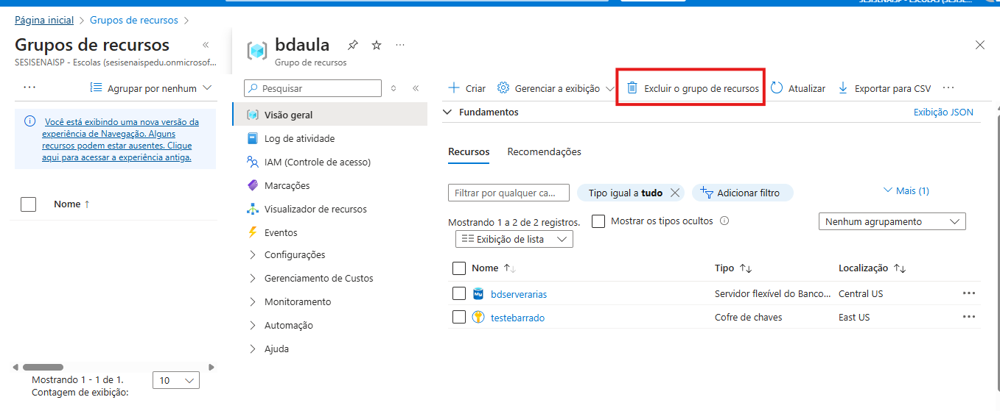


# Referências
- [O que é o Banco de Dados do Azure para MySQL - Servidor Flexível?](https://learn.microsoft.com/pt-br/azure/mysql/flexible-server/overview)
- [Início Rápido: criar uma instância do Banco de Dados do Azure para MySQL com o portal do Azure](https://learn.microsoft.com/pt-br/azure/mysql/flexible-server/quickstart-create-server-portal)